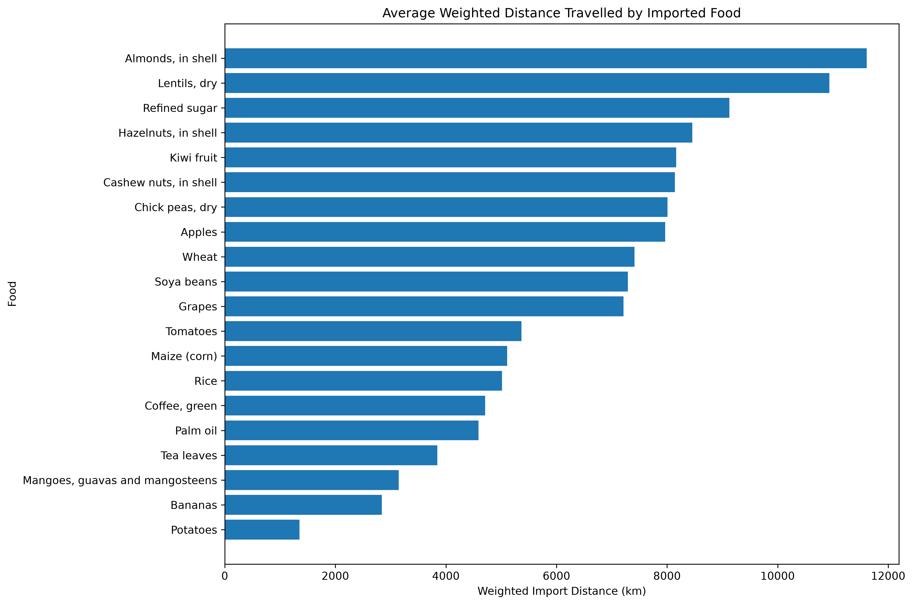

# Food Miles: Tracking the Journey of Food

An interactive research dashboard showing how far food travels to reach India, and how imports relate to India's own production. Built for an M.Sc. Computer Science **Data Visualization** project with **Python, Streamlit, Pandas and Plotly**.

> Food Miles here means *trade quantity × estimated straight-line distance*. They are **not** actual shipping routes and **not** carbon emissions.

## Overview

No public dataset records the route of a food item from farm to plate, but public data does record trade between countries. This project combines FAOSTAT trade quantities, FAOSTAT production data and estimated distances to measure how far **20 foods** travel to and from India during **2000–2024**.

**Main research question:** How far does food travel to and from India through international trade, and what patterns appear when these journeys are visualized by food, source country and year?

## Features

- Search and select any of the 20 foods; every section updates
- KPI cards, source-country cards and an interactive map (bubble size = quantity, colour = distance)
- Import vs export Food Miles, and year-wise trends
- India production, trade and import dependency
- Top-five research findings and a searchable, sortable comparison table
- CSV downloads, plus methodology, data sources and limitations inside the app



*Dashboard screenshots will be added here.*

## Data

| Dataset | Source | Used for |
|---|---|---|
| Detailed Trade Matrix | [FAOSTAT](https://www.fao.org/faostat/) | Import and export quantities (tonnes) by partner country and year, India as reporter |
| Crops and Livestock Products | [FAOSTAT](https://www.fao.org/faostat/) | National production (tonnes) for import dependency |
| GeoDist | [CEPII](http://www.cepii.fr/) | Capital-city coordinates for distances, and a cross-check |

**Foods:** Almonds, Apples, Bananas, Cashew nuts, Chick peas, Coffee, Grapes, Hazelnuts, Kiwi fruit, Lentils, Maize, Mangoes, Palm oil, Potatoes, Refined sugar, Rice, Soya beans, Tea leaves, Tomatoes, Wheat.

Raw downloads are **not** stored in this repository. The cleaned files the app needs are in `data/processed/`.

## Methodology

1. **Clean:** remove zero and missing values, drop the FAO aggregate "China" (to avoid double counting), and join countries by numeric code instead of name.
2. **Distance:** straight-line (great-circle) distance from India to each partner's capital, using the **Haversine formula**, checked against CEPII's distances (within about 0.1%).
3. **Food Miles** = quantity (tonnes) × distance (km). **Weighted distance** = total Food Miles ÷ total quantity.
4. **Low-volume foods** (under 10,000 tonnes imported: Bananas, Hazelnuts, Mangoes, Rice, Tomatoes) are shown but not used in rankings.
5. **Import dependency** = imports ÷ (production + imports − exports) × 100, pooled over 2000–2024. It is not calculated for Refined sugar or where production is missing in the data.

## Key findings (2000–2024)

- **Longest weighted import distance:** Almonds (about 11,612 km), Lentils (10,938 km), Refined sugar (9,126 km).
- **Highest total import Food Miles:** Palm oil (727.81 billion tonne-km), then Cashew nuts (148.44) and Lentils (133.89).
- **Highest import dependency:** Almonds (93.85%), Kiwi fruit (73.12%), Cashew nuts (52.67%).
- **Trend:** total import Food Miles rose from 16.59 to 82.92 billion tonne-km (2000 to 2024). Palm oil's share fell from 80.3% to 46.6%. The data cannot show whether the rise comes from larger volumes, longer distances, or both.

## Run it

You need Python 3.11 and Git (tested with Python 3.11.4 and Streamlit 1.64.0).

```bash
git clone https://github.com/<your-username>/food-miles-india.git
cd food-miles-india
python -m venv venv
venv\Scripts\activate          # macOS / Linux: source venv/bin/activate
pip install -r requirements.txt
streamlit run app.py
```

The app opens at `http://localhost:8501` and reads only `data/processed/`.

## Project structure

```
app.py              Streamlit dashboard
requirements.txt    Pinned package versions
data/raw/           Original downloads (not uploaded)
data/processed/     Cleaned data, analysis tables, dashboard data
notebooks/          Numbered pipeline scripts, plus validation and check scripts
outputs/figures/    Static research charts
docs/               Validation outputs
```

To rebuild the processed files, download the FAOSTAT and CEPII data into `data/raw/` and run the numbered scripts in `notebooks/` in order.

## Main limitations

- Distances are straight-line estimates between capitals, not shipping routes.
- Trade data records the partner country shown by customs, which may differ from where food was grown.
- Some FAOSTAT values are imputed or estimated.
- Import dependency ignores stocks, seed, feed and waste.
- Transport mode, fuel and storage are not included.

The full list is in the app's Limitations tab.

## Future scope

Seasonal analysis, state-level analysis with Indian crop data, correlation analysis, route-based distances and emissions estimates, and online deployment.

## Credits

- **FAOSTAT.** Food and Agriculture Organization of the United Nations. https://www.fao.org/faostat/
- **CEPII GeoDist.** Mayer, T. and Zignago, S. (2011). *Notes on CEPII's distances measures: the GeoDist database.* CEPII Working Paper 2011-25.
- Built with Streamlit, Pandas, NumPy and Plotly.

**Author:** Srushti Surve, M.Sc. Computer Science (Computational Intelligence).